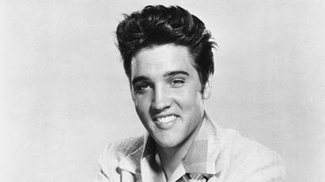

# Elvis Presley Biography

Elvis Aaron Presley (January 8, 1935 – August 16, 1977) – an American singer, musician and actor.

Elvis Presley became one of the most influential cultural icons of a generation. He is commonly referred to as the “The King of Rock ‘n’ Roll” and epitomises the post-war pop generation.

Elvis was born in Tupelo, Mississippi. When he was 13, his family moved to Memphis, Tennessee. Elvis was relatively shy and as a youngster was not keen on performing in public. However, he received a guitar as a present and learnt to play and sing; he gained no formal musical training, but had an innate natural talent and could easily pick up music. As a teenager, he was uninterested in school – but become absorbed in music, listening to a huge range of contemporary American music. He also started to sport a distinctive look with sideburns and styled hair. This image would later become an ‘Elvis’ trademark.

In 1953, he went to Sun recording studio – to record a song for his mother, but also with the hope he may get noticed and offered a recording deal. However, it didn’t come to anything; he was also turned down for auditions to other groups. In April 1954, he took a job as a truck driver.

However, later on in the year, the Sun boss Sam Phillips invited Elvis to come in for a recording session. Initially, the recording session was unpromising, but towards the end of the allotted time, Elvis started to play a song he had composed himself. Phillips was immediately impressed by the verve, enthusiasm and dynamism of Elvis’s music. Phillips believed that Elvis had a unique voice and talent which could capture the interest of Americans.

For his first studio recording, Elvis performed the 1946 blues number, Arthur Crudup’s “That’s All Right”; it was well received on local radio stations.

This initial success launched Presley into a lucrative pop music career.

In January 1956, Presley was signed by RCA Records. His first single, “Heartbreak Hotel“, was released in January and became a best-selling hit – staying at number one for seven weeks, and selling over one million copies.

His performances were a fusion of country, gospel, pop and rhythm and blues. His unique gravelly voice gave the impression Presley combined both ‘black’ and ‘white’ sounds, something which was an issue during an era of tense civil rights campaigns. Elvis’s on stage routines were also criticised for their flamboyance and provocativeness; he was criticised for the idea that rock ‘n ‘roll music was having a negative effect on American teenagers, making them more rebellious. As the leading figure of pop music, Presley was often the target of these criticisms. However, he defended his music saying:
“No, I haven’t, I don’t feel like I’m doing anything wrong. … I don’t see how any type of music would have any bad influence on people when it’s only music. … I mean, how would rock ‘n’ roll music make anyone rebel against their parents?”

However, if Presley was considered a controversial and a rebellious figure, it just made him more popular with young listeners. His catapult to stardom was helped by a rivalry between TV presenters, such as Steve Allen and Ed Sullivan. Elvis proved a star attraction on tv talk shows, and the competition between presenters helped to make Elvis a national celebrity. It also helped bring rock ‘n’ roll into the mainstream. John Lennon, of the Beatles, described the effect that Elvis had on his musical development.

